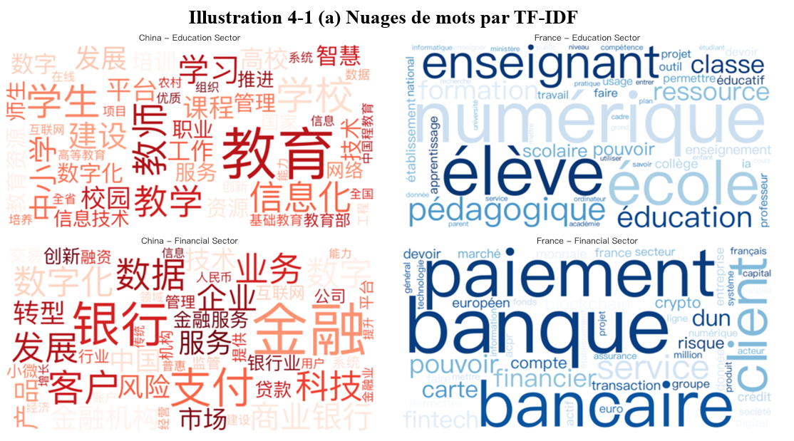
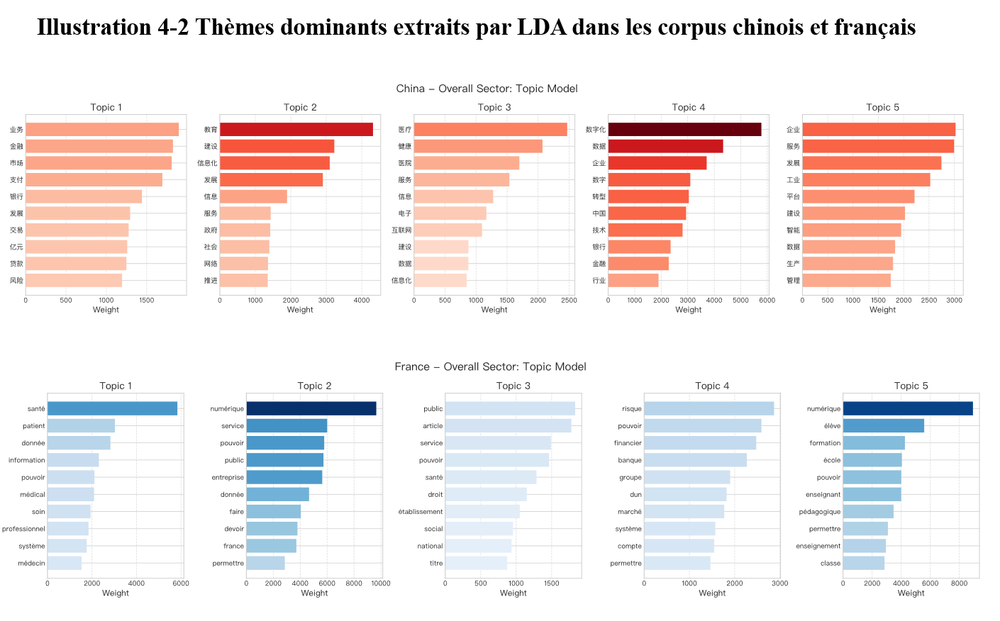
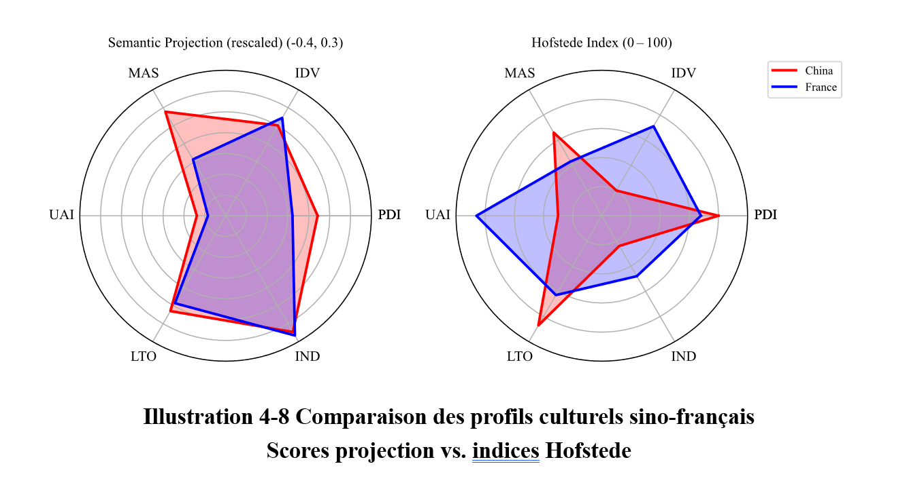
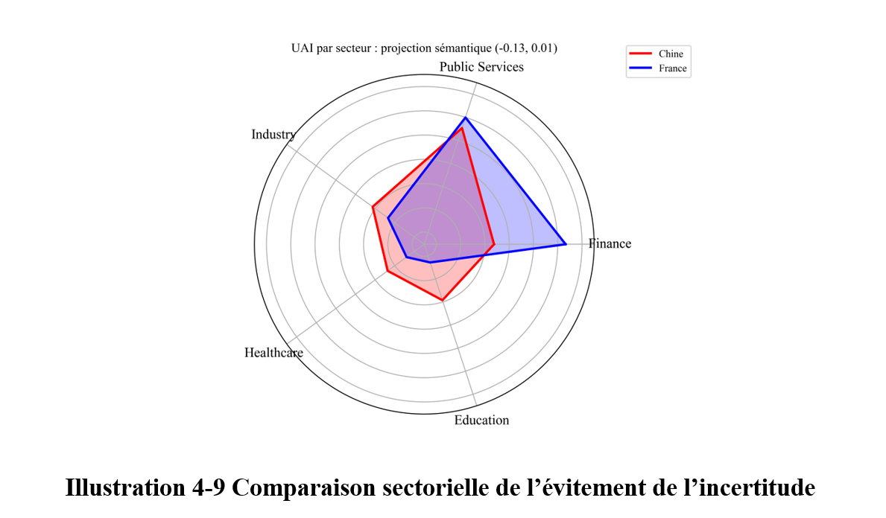
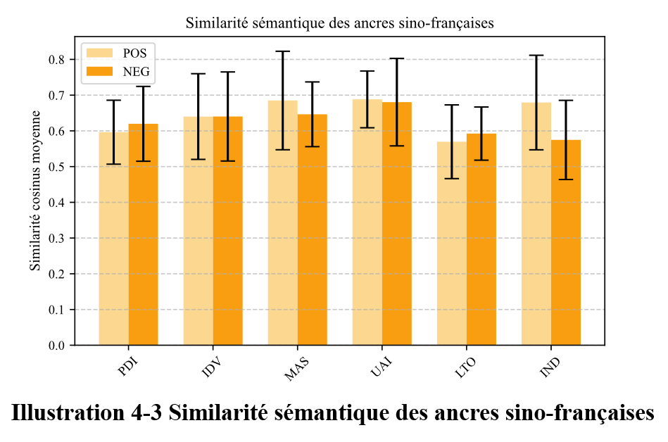
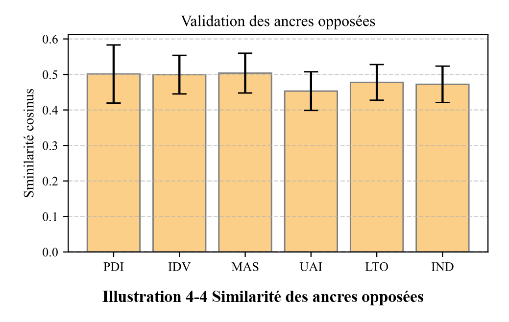
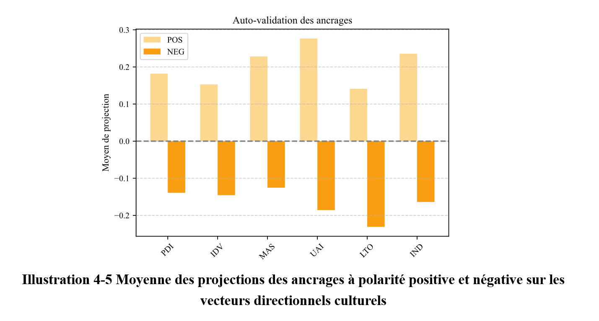
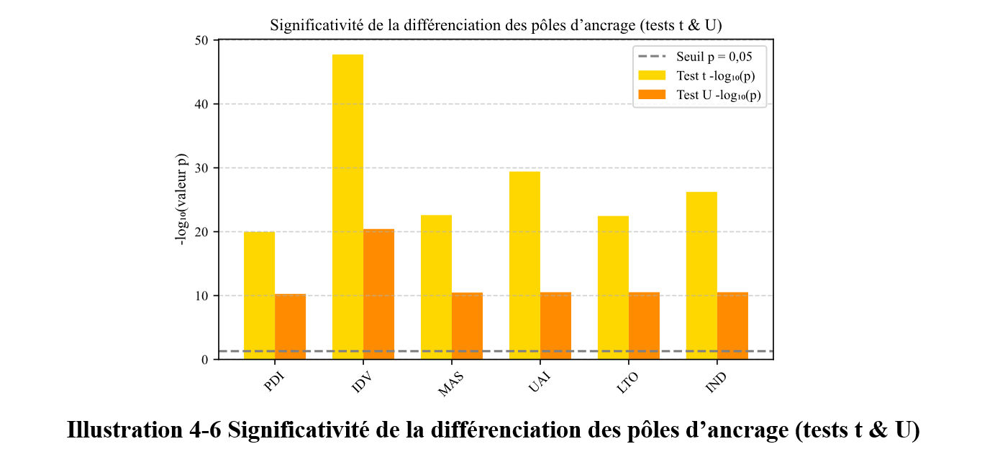
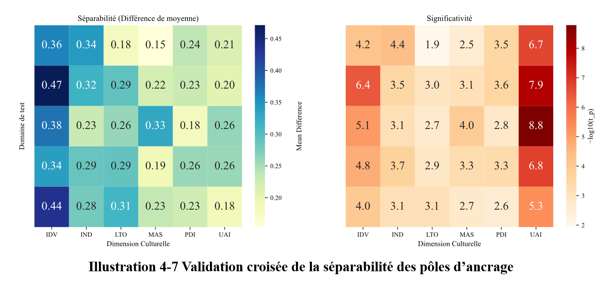

# 基于Anchor Embedding投影的文化对齐与分析

本项目聚焦中国与法国这两个在治理理念和规范体系上高度差异化的主要经济体，比较研究其数字化转型背后的文化根源。

- 构建了涵盖 2005 至 2025 年、横跨教育、金融、工业、医疗和公共服务五大关键领域的多语种文本语料库。
- 从官方文件、媒体报道、学术论文及典型案例中提取了超过 500 万词条。
- 融合 TF-IDF 加权、 LDA 主题建模与多语种嵌入投影，结合霍夫斯泰德文化维度模型， 对各类数字化转型文本中所蕴含的文化进行了定性和定量分析。
- 通过跨语言一致性检验、锚点可分性分析，以及跨领域交叉验证，验证了嵌入分析方法的稳健性。
- 研究表明，基于嵌入投影的自然语言处理的分析框架能够捕捉传统离散量化模型所忽略的领域特有的文化语义特征。

## Findings

研究发现，中法两国在权力距离、不确定性规避和集体主义等方面呈现差异，这与传统的跨文化研究结果大体一致。





从理论层面来看，法国的“程序型现代性”侧重法律—官僚体系的理性建构，而中国则更倾向于以国家协调和技术自主为核心的“项目型现代性”。



进一步的嵌入分析也揭示出一些**反差**现象：在教育与医疗等战略重点领域中，中国政策话语中表现出较强的风险规避倾向，这与霍夫斯泰德模型中中国“不确定性规避指数”较低的描述并不一致。



## Validation











## 项目概述

本项目专注于中法两国不同行业文本数据的文化分析，涵盖数据预处理、TF-IDF分析、主题分析和基于Hofstede文化维度的分析。通过一系列处理和分析步骤，旨在挖掘中法两国不同行业文本背后的文化特征和语言模式。

## 项目结构
```
cultural-analysis/
├── notebooks/
│   ├── 4.1.txt_viewer.py         # TXT文件查看器
│   ├── 5.1.analyzer.py           # 数据分析模块
│   └── config.py                 # 配置文件
├── src/
│   └── preprocessor.py           # 数据预处理模块
└── data/
    ├── cleaned/                  # 原始数据目录
    └── processed/                # 处理后的数据目录
```

## 安装依赖
确保你已经安装了以下Python库：
```bash
pip install transformers sklearn pandas nltk jieba spacy tqdm httpx
```
同时，需要下载NLTK相关资源：
```python
import nltk
nltk.download('punkt')
nltk.download('stopwords')
nltk.download('wordnet')
```
以及安装法语的spaCy模型：
```bash
python -m spacy download fr_core_news_sm
```

## 配置环境
在运行项目之前，需要设置环境变量`DEEPSEEK_API_KEY`，该API用于获取文本嵌入：
```bash
export DEEPSEEK_API_KEY=your_api_key
```

## 使用说明

### 数据预处理
运行`src/preprocessor.py`脚本对原始数据进行预处理：
```bash
python src/preprocessor.py
```
该脚本会完成以下操作：
1. 遍历原始数据目录，对每个文本文件进行标准化、分词、词形还原和移除停用词等处理。
2. 保存处理后的文本和元数据。
3. 生成元数据汇总和按国家的详细统计信息。

### 数据分析
运行`notebooks/5.1.analyzer.py`脚本进行数据分析：
```bash
python notebooks/5.1.analyzer.py
```
该脚本会执行以下分析：
1. **TF-IDF分析**：找出每个国家和行业的关键词。
2. **主题分析**：使用LDA提取文本主题。
3. **文化维度分析**：基于Hofstede文化维度进行分析，并行处理中国和法国的数据。

分析结果将保存为`data/results/analysis_results.json`文件。

### TXT文件查看器
运行`notebooks/4.1.txt_viewer.py`脚本启动TXT文件查看器：
```bash
python notebooks/4.1.txt_viewer.py
```
使用左右箭头键切换文件查看。

## 代码说明

### `src/preprocessor.py`
- **DataPreprocessor类**：负责数据预处理的核心功能，包括文本标准化、分词、词形还原、移除停用词和保存处理后的数据。
- **_generate_metadata_summary方法**：生成元数据汇总和按国家的详细统计信息。

### `notebooks/5.1.analyzer.py`
- **DataAnalyzer类**：实现各种文本分析方法，包括TF-IDF分析、主题分析和文化维度分析。
- **analyze_all方法**：运行所有分析并保存结果。
- **_embed_sentences方法**：并发获取句子嵌入，支持自动重试和指数退避。

### `notebooks/4.1.txt_viewer.py`
- **TxtViewer类**：创建一个简单的TXT文件查看器，支持左右箭头切换文件。

## 注意事项
- 确保原始数据存储在`data/cleaned`目录下，且每个文本文件有对应的JSON元数据文件。
- 运行文化维度分析时，需要确保API可用，并且`DEEPSEEK_API_KEY`环境变量已正确设置。
- 处理中文数据时使用了`jieba`分词，确保其正常工作。

## 许可证
本项目采用[MIT许可证](LICENSE)。